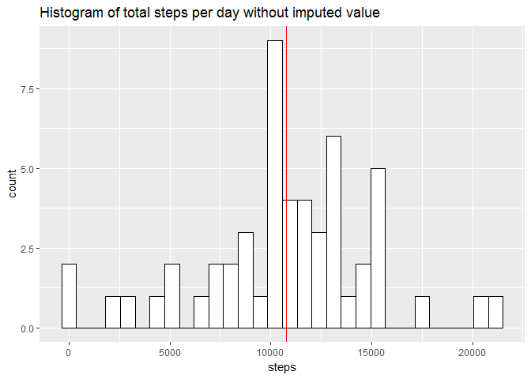

# Reproducible Research: Peer Assessment 1


## Loading and preprocessing the data


```r
setwd("S:/GitRepository/Reproducible Research - Project 1/RepData_PeerAssessment1")

if (!dir.exists("./data/")){
  dir.create("./data/")
  unzip("activity.zip", exdir = "./data")
}

activity <- read.csv("./data/activity.csv", header = TRUE, colClasses = c("numeric","Date","numeric"))
```

## What is mean total number of steps taken per day?


```r
suppressMessages(library(dplyr))
suppressMessages(library(ggplot2))
stepsperday.total <- activity %>% group_by(date) %>% summarise(steps=sum(steps))
stepsperday.mean <- mean(stepsperday.total$steps, na.rm = TRUE)
stepsperday.median <- median(stepsperday.total$steps, na.rm = TRUE)
agg.summary <- as.data.frame(rbind(stepsperday.mean, stepsperday.median))
colnames(agg.summary) <- "Without.imputed.values"
```


```r
p1 <- ggplot(data = stepsperday.total, aes(x = steps)) +
  geom_histogram(fill = "white", colour="black")+
  geom_vline(data = agg.summary, aes(xintercept = Without.imputed.values), colour = "red")+
  ggtitle("Histogram of total steps per day without imputed value")
p1
```

```
## `stat_bin()` using `bins = 30`. Pick better value with `binwidth`.
```

<!-- -->

The **Mean** steps per day is 10766.19.  
The **Median** steps per day is 10765.

## What is the average daily activity pattern?


```r
suppressMessages(library(data.table))
intdata <- activity %>% group_by(interval) %>% summarise(steps = mean(steps, na.rm=TRUE))
qplot(x = interval , y = steps, data = intdata, geom = "line", main ="Average steps per interval")
```

<!-- -->

```r
maxstep <- intdata[intdata$steps == max(intdata$steps), "interval"]
```

The interval with the highest average number of steps is **835**.

## Imputing missing values


```r
sumna <- sum(is.na(activity$steps))
```
There are a total of **2304** missing step values.

In order to populate missing value, I have used the average of each intervals to impute the missing values.

```r
suppressMessages(library(gridExtra))
activity.impute <- activity
#Determine which rows contain NA values
narows <- which(is.na(activity$steps))
#Get the previously calculate average steps per interval
imputevalues <- intdata[intdata$interval == activity[narows,"interval"],"steps"]
#Assigning NA values a value 
activity.impute[is.na(activity.impute$steps),"steps"] <- imputevalues[!is.na(imputevalues$steps),]
#Calculating total number of steps per day with new imputed values
imputedsteps.total <- activity.impute %>% group_by(date) %>% summarise(steps=sum(steps))
imputedsteps.mean <- mean(imputedsteps.total$steps, na.rm = TRUE)
imputedsteps.median <- median(imputedsteps.total$steps, na.rm = TRUE)

agg.summary <- cbind(agg.summary, rbind(imputedsteps.mean,imputedsteps.median))
colnames(agg.summary) <- c("Without.imputed.values","With.imputed.values")
p2<- ggplot(data = imputedsteps.total, aes(x = steps))+
  geom_histogram(fill = "white", colour="black")+
  geom_vline(data = agg.summary, aes(xintercept = With.imputed.values), colour = "red")+
  ggtitle("Histogram of total steps per day with imputed values ")
grid.arrange(p2,p1, ncol=1)
```

```
## `stat_bin()` using `bins = 30`. Pick better value with `binwidth`.
## `stat_bin()` using `bins = 30`. Pick better value with `binwidth`.
```

<!-- -->

From the histograms above, we can see that the values are distributed more less distrbuted over a wider range. There are a higher frequency of   
values that are centrally distributed.  

From the table below, we can see that there isn't a significant different between the mean and median with and without imputed values.  

|   |Without Imputed values   |With Imputed values   |
|---|---|---|
| mean  |10766.19 |10766.19    |
| median|10765   |10766.19   |


## Are there differences in activity patterns between weekdays and weekends?

There does appear to be differences in the patterns between weekdays and weekends.  
From the graph below, it appears that people walk a greater distance on average in the interval 750 - 1000 on a weekday than on a weekend.
However, people appear to walk more over the course of a day on a weekend.


```r
activity.impute[,"weekday"] <- weekdays(activity.impute$date)
weekendrows <- which(activity.impute$weekday == "Saturday" |activity.impute$weekday == "Sunday")
activity.impute[weekendrows, "weekday"] <- "weekend"
activity.impute[-weekendrows, "weekday"] <- "weekday"
activity.impute$weekday <- as.factor(activity.impute$weekday)

intdata.weekday <- activity.impute %>% group_by(interval, weekday) %>% summarise(steps = mean(steps, na.rm=TRUE))
qplot(x = interval , y = steps, data = intdata.weekday, geom = "line", main ="Average steps per interval and weekday", facets = weekday ~.)
```

<!-- -->
